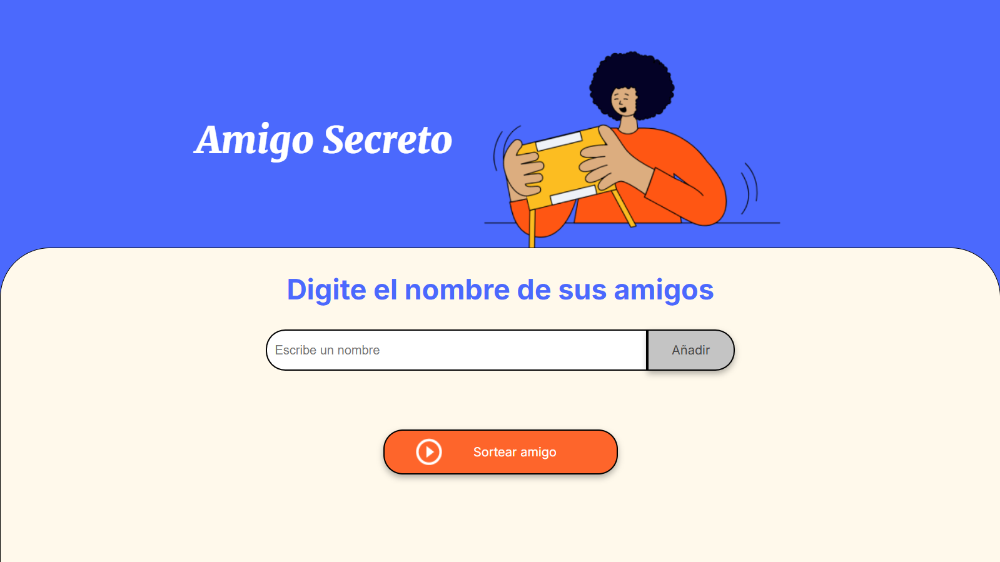
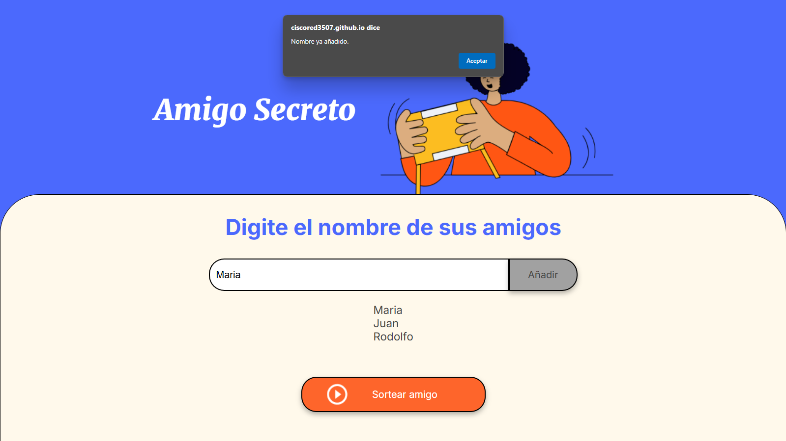
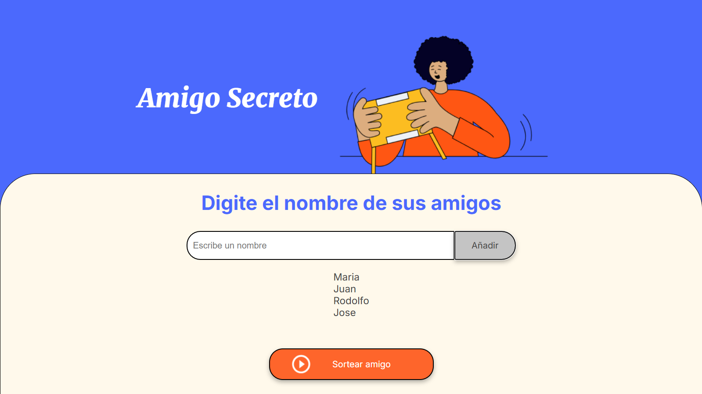
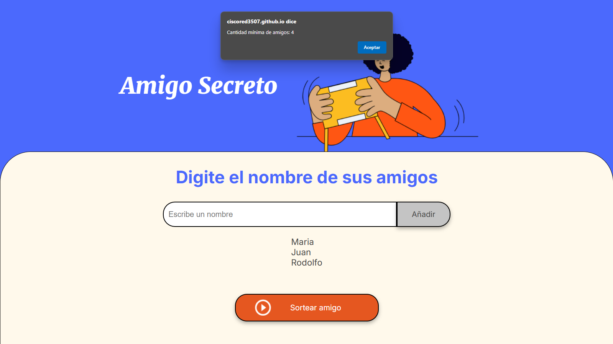
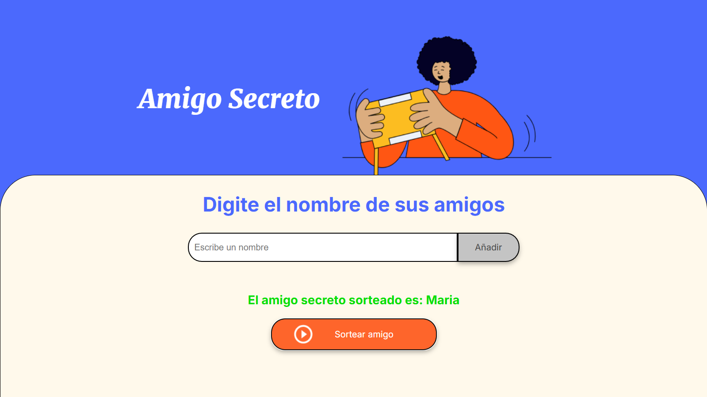

# Challege Amigo Secreto

En este desafío, desarrollarás una aplicación que permita a los usuarios ingresar nombres de amigos en una lista para luego realizar un sorteo aleatorio y determinar quién es el "amigo secreto".

El usuario deberá agregar nombres mediante un campo de texto y un botón "Adicionar". Los nombres ingresados se mostrarán en una lista visible en la página, y al finalizar, un botón "Sortear Amigo" seleccionará uno de los nombres de forma aleatoria, mostrando el resultado en pantalla.

# Hola, soy Jose Francisco! 👋

## Otras secciones comunes del perfil de Github

🧠 Actualmente estoy aprendiendo Lógica de Programación con HTML, CSS y JavaScript.

## Preguntas Frecuentes (FAQ)
#### ¿Cuál es el propósito de esta aplicación?

La aplicación está diseñada para facilitar el proceso de organizar un sorteo de amigo secreto de manera fácil y rápida.

#### ¿Cuál es la cantidad mínima de amigos que se necesita para realizar el sorteo?

Se necesita un mínimo de 4 amigos en la lista para poder realizar el sorteo de amigo secreto.

#### ¿Qué sucede si intento agregar un nombre duplicado a la lista?

La aplicación mostrará una alerta indicando que el nombre ya ha sido añadido, y no permitirá agregar nombres duplicados.

#### ¿Puedo agregar amigos después de realizar el sorteo?

Sí, después de realizar el sorteo, la lista de amigos se vacía, por lo que puedes comenzar a agregar nuevos nombres de amigos nuevamente.

#### ¿Qué pasa si el campo de entrada está vacío al intentar agregar un amigo?

La aplicación mostrará una alerta indicando que debes ingresar un nombre antes de poder agregarlo a la lista.

#### ¿Dónde se muestran los resultados del sorteo?

El resultado del sorteo se muestra en el elemento HTML con el id resultado.

#### Uso
1.-Abre el archivo HTML en tu navegador web.

2.- Utiliza los campos de entrada y los botones para agregar amigos y realizar el sorteo.

¡Disfruta organizando tu amigo secreto con esta aplicación!

# Proyecto: Amigo Secreto

Este proyecto es una aplicación web simple para gestionar y realizar el sorteo de un amigo secreto.

## Descripción

La aplicación permite agregar nombres a una lista de amigos y realizar un sorteo de amigo secreto. Se requiere un mínimo de 4 amigos en la lista para llevar a cabo el sorteo.

## Funcionalidades

1. **Agregar Amigos**: Los usuarios pueden ingresar nombres de amigos para agregarlos a una lista.
2. **Verificación de Duplicados**: La aplicación verifica que no se agreguen nombres duplicados a la lista.
3. **Sorteo de Amigo Secreto**: Se selecciona un amigo secreto al azar de la lista de amigos, y se muestra el resultado. Después del sorteo, la lista de amigos se vacía.

## Instrucciones

### Agregar Amigos

1. Ingresa el nombre de un amigo en el campo de entrada.
2. Haz clic en el botón "Añadir".
3. Si el campo de entrada está vacío, se mostrará una alerta solicitando ingresar un nombre.
4. Si el nombre ya ha sido añadido, se mostrará una alerta indicando que el nombre ya está en la lista.
5. El nombre del amigo se añadirá a la lista y se mostrará en la página.

### Sortear Amigo Secreto

1. Haz clic en el botón "Sortear Amigo".
2. Si hay menos de 4 amigos en la lista, se mostrará una alerta indicando que la cantidad mínima de amigos es 4.
3. Se seleccionará un amigo al azar y se mostrará el nombre del amigo secreto sorteado.
4. La lista de amigos se vaciará después del sorteo.

## Código

```javascript
// Array vacío para almacenar los nombres de los amigos
let amigos = [];

function agregarAmigo() {
    // Obtener el elemento de entrada con el id 'amigo'
    let amigo = document.getElementById('amigo');
    // Verificar si el valor del campo de entrada está vacío
    if (amigo.value == '') {
        // Mostrar una alerta si el campo está vacío
        alert('Por favor, inserte un nombre.');
        return;
    }
    // Verificar si el nombre del amigo ya ha sido añadido
    if (amigos.includes(amigo.value)) {
        // Mostrar una alerta si el nombre ya está en la lista
        alert('Nombre ya añadido.');
        return;
    }
    // Obtener el elemento de la lista con el id 'listaAmigos'
    let lista = document.getElementById('listaAmigos');
    // Añadir el nombre del amigo al array
    amigos.push(amigo.value);
    // Crear un nuevo elemento de lista
    let nuevoElemento = document.createElement('li');
    // Establecer el texto del nuevo elemento como el nombre del amigo
    nuevoElemento.textContent = amigo.value;
    // Añadir el nuevo elemento a la lista
    lista.appendChild(nuevoElemento);
    // Vaciar el campo de entrada
    amigo.value = '';
} 

function sortearAmigo() {
    // Verificar si hay al menos 4 amigos en la lista
    if (amigos.length < 4) {
        // Mostrar una alerta si hay menos de 4 amigos
        alert('Cantidad mínima de amigos: 4');
        return;
    }
    // Obtener el elemento con el id 'resultado'
    let sorteo = document.getElementById('resultado');
    // Limpiar cualquier resultado anterior
    sorteo.innerHTML = '';
    // Seleccionar un amigo al azar de la lista
    const amigoSorteado = amigos[Math.floor(Math.random() * amigos.length)];
    // Mostrar el nombre del amigo sorteado en el elemento 'resultado'
    sorteo.innerHTML = 'El amigo secreto sorteado es: ' + amigoSorteado;
    // Vaciar la lista de amigos
    amigos = [];
    // Obtener el elemento de la lista con el id 'listaAmigos'
    let lista = document.getElementById('listaAmigos');
    // Limpiar la lista de amigos
    lista.innerHTML = '';
}
